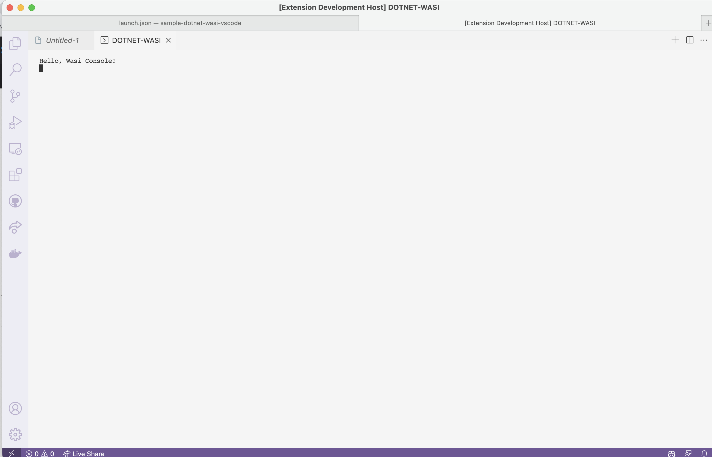

# VS Code extension using .NET WASI

This is an example VS Code extension that uses the VS Code `wasm-wasi` host to run a .NET WASI WebAssembly module.

## Prerequisites

* .NET 8 Preview 6
* `dotnet workload install wasi-sdk`
* Install the WASI SDK from <https://github.com/WebAssembly/wasi-sdk/releases>
* Set the `WASI_SDK_PATH` environment variable to point to the place where you put the WASI SDK

## Building

```console
% cd vscode
% npm install
% npm run build
```

## Running

1. Open this folder in VS Code
2. Press "F5" with the "Launch Extension" configuration
3. in the `[Extension Development Host]` window, press Ctrl-Shift-P (or Cmd-Shift-P) and run `wasm: run .NET WASI Program`

A console should pop up with a message:


